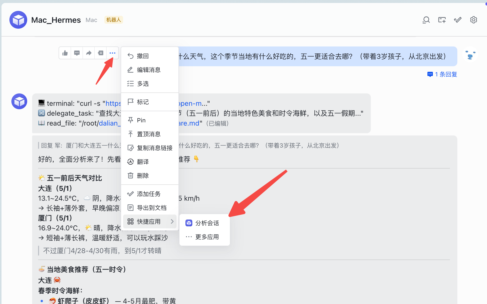
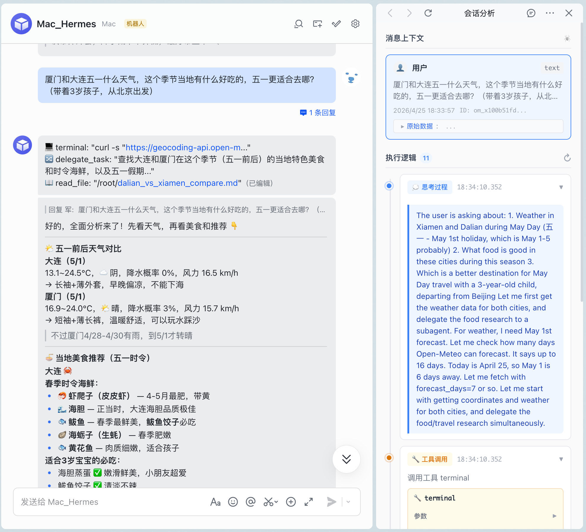
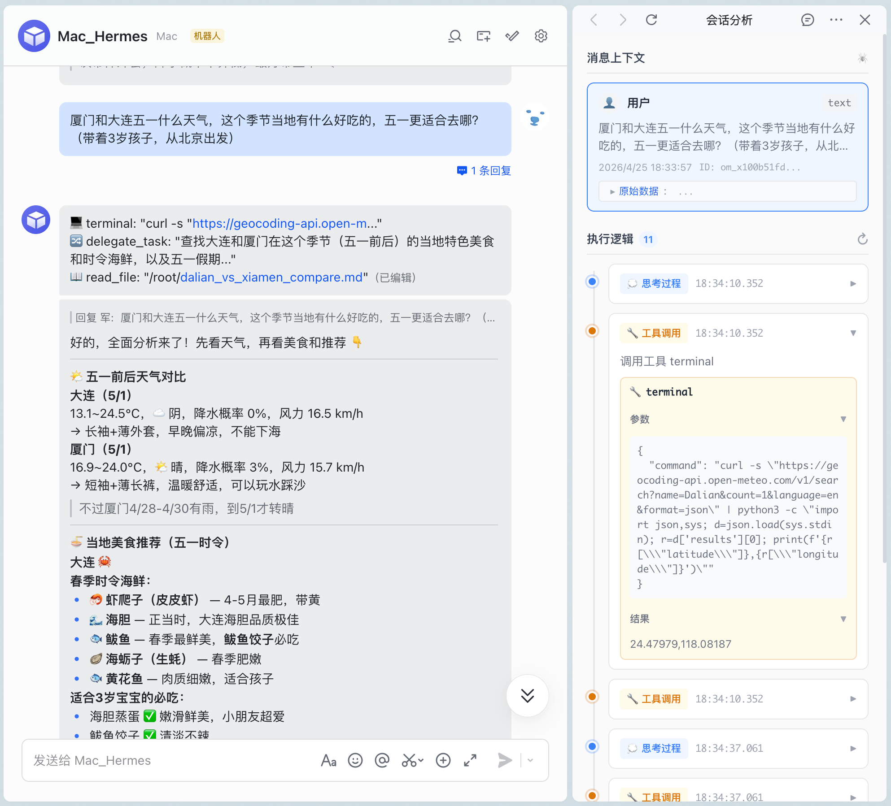
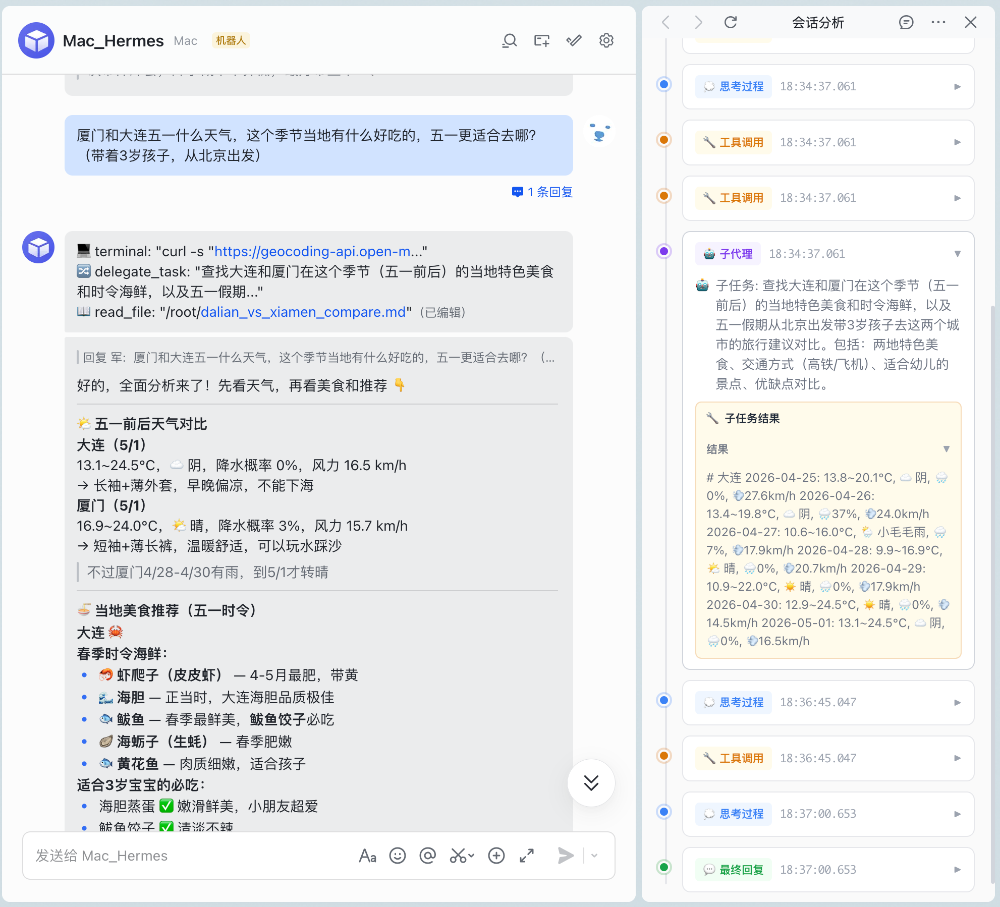
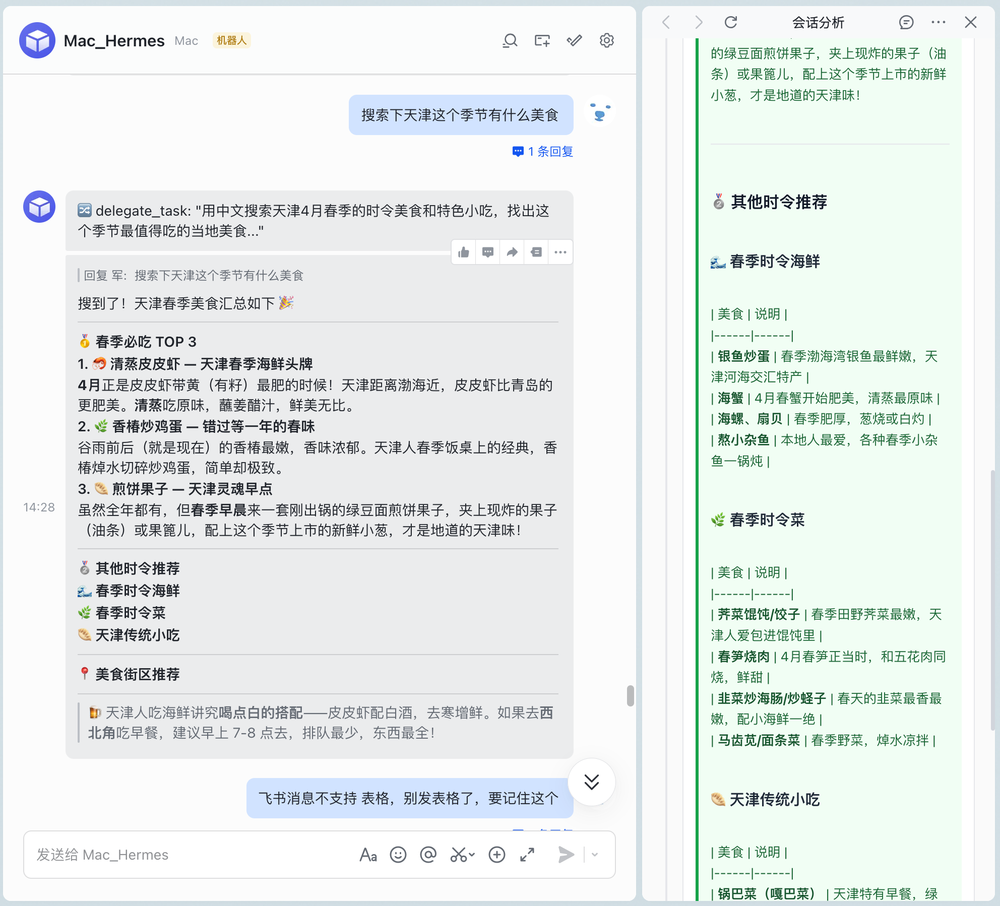

# 【Code with SOLO】用 SOLO 为 Hermes Agent 构建飞书侧边栏，让 AI 的思考过程"透明化"

## 摘要

我用 TRAE SOLO 为自研的 Hermes Agent 搭建了一个飞书侧边栏应用，用户在飞书中右键机器人消息即可查看完整的执行逻辑——包括 AI 的思考过程、工具调用细节、子代理任务和最终回复。项目从 0 到上线仅用了一个下午，上线第一天就通过侧边栏发现了"飞书消息不支持 Markdown 表格"的兼容性问题，直接推动了 Hermes 输出策略的优化。

## 背景

我是一名 AI Agent 开发者，维护着一个名为 **Hermes Agent** 的开源 AI 助手框架。Hermes 通过飞书（Lark）与用户交互，能够调用终端命令、浏览器、子代理等工具完成复杂任务。

**面临的核心问题**：Hermes 的回复质量很高，但用户只能看到最终结果，看不到 AI 是怎么思考的、调用了什么工具、中间经历了哪些步骤。对于复杂的任务（如搜索美食、对比城市、分析数据），用户无法判断 AI 的推理是否可靠，也无法复用 AI 发现的信息。

**我想要的效果**：像 Xcode 的调试器一样，让用户能"单步调试" AI 的思考过程。

## 实践过程

### 第一步：需求拆解

我把这个需求拆解为几个关键子任务：

1. **飞书消息快捷操作入口**：在飞书中右键消息，通过"快捷应用"打开侧边栏
2. **飞书 JS-SDK 签名认证**：侧边栏需要通过飞书 h5sdk.config 签名才能调用 JS-SDK
3. **执行日志查询**：从 Hermes 的 SQLite 数据库中提取执行轨迹
4. **消息匹配**：将飞书消息与 Hermes 数据库中的记录精确匹配
5. **时间线 UI**：以可视化时间线展示思考、工具调用、子代理、回复

### 第二步：技术选型

- **前端**：React 18 + Vite 5（SOLO 推荐）
- **后端**：Vite 中间件（无需独立后端，开发效率最高）
- **数据库**：better-sqlite3（只读模式读取 Hermes 的 state.db）
- **飞书集成**：H5 JS SDK 1.5.16

### 第三步：用 SOLO 逐步实现

整个开发过程都是通过 TRAE SOLO 完成的，以下是关键节点：

#### 3.1 飞书 h5sdk.config 签名

这是第一个技术难点。飞书侧边栏需要通过 JS-SDK 签名才能调用 `getBlockActionSourceDetail` 等能力。签名流程是：`app_access_token → jsapi_ticket → SHA1 签名`。

我让 SOLO 在 Vite 中间件中实现了完整的签名链，包括 token 缓存（7200 秒有效期，提前 300 秒刷新）：

```javascript
// vite.config.js — 签名中间件
app.use('/api/h5sdk-config', async (req, res) => {
  const ticket = await getJsapiTicket()
  const signature = sha1(`jsapi_ticket=${ticket}&noncestr=${nonceStr}&timestamp=${timestamp}&url=${url}`)
  res.json({ appId, timestamp, nonceStr, signature })
})
```

#### 3.2 执行日志查询与消息匹配

这是最核心也最折腾的部分。Hermes 把执行日志存在 SQLite 中，但飞书消息和 Hermes 数据库之间没有直接关联（没有存储 openMessageId）。

我最初用时间窗口匹配（±300 秒），但很快发现飞书的 `createTime`（消息发送时间）和 Hermes 的 `timestamp`（处理写入时间）差值不固定——实测从 40 秒到 24 分钟不等，导致频繁匹配错误。

经过多次迭代，最终改为**内容优先匹配**策略：在所有飞书 session 中搜索内容匹配的 user 消息，按时间排序，不设时间上限。如果数据库中没有对应消息（Hermes 还在处理），直接返回空结果。

#### 3.3 时间线 UI

用 React 实现了一个时间线组件，不同类型的步骤用不同颜色区分：

- 🔵 **思考过程**（蓝色）：AI 的内部推理
- 🟠 **工具调用**（橙色）：terminal、skill_view 等
- 🟣 **子代理**（紫色）：delegate_task 委派的任务
- 🟢 **最终回复**（绿色）：返回给用户的内容

工具调用的参数和结果用可折叠的 JSON 树展示，最终回复支持 Markdown 渲染。

### 第四步：踩坑与修复

#### 坑 1：消息匹配错误

用户问"青岛有什么好吃的"，侧边栏显示的是"青岛天气"的执行日志。原因是时间窗口太小（±300 秒），正确消息被过滤掉了。改为内容优先匹配后彻底解决。

#### 坑 2：Hermes 处理延迟导致匹配失败

用户在 Hermes 还没处理完消息时就打开了侧边栏，数据库中还没有这条消息。之前的逻辑会回退到时间匹配，匹配到错误的消息。去掉时间回退后，正确显示"暂无执行日志"。

#### 坑 3：执行日志时间间隔不准确

发现所有步骤的 timestamp 几乎相同（20 步总跨度仅 384ms），但实际执行了多次 curl 和子代理。原因是 Hermes 使用批量写入机制——所有消息在对话结束后才一次性写入 SQLite。最终修改了 Hermes 源码，在消息创建时就记录真实时间戳。

#### 坑 4：飞书消息不支持 Markdown 表格

这是上线第一天通过侧边栏发现的！侧边栏正确渲染了 Markdown 表格，但飞书消息中表格语法裸露显示。这直接推动了 Hermes 输出策略的优化——在飞书场景下禁用表格输出。

## 成果展示

### 打开方式

在飞书中点击机器人消息的"⋯"按钮，选择"快捷应用"→"分析会话"，即可打开侧边栏：



### 思考过程展示

侧边栏以时间线形式展示 AI 的思考过程，可以展开查看完整的推理内容：



### 工具调用展示

每个工具调用的参数和结果都可以展开查看，支持 JSON 递归折叠：



### 子代理展示

`delegate_task` 子代理调用以紫色标识，可以展开查看子任务描述和返回结果：



### 最终回复展示

最终回复支持完整的 Markdown 渲染（代码块、列表、粗体等），同时通过侧边栏对比发现飞书消息不支持表格格式：



### 代码仓库

完整代码和适配文档已开源：[https://github.com/nujgnoix/feishu-sidebar](https://github.com/nujgnoix/feishu-sidebar)

README 中包含完整的 **Hermes Agent 适配指南**，其他 Hermes 用户可以参照文档自主安装和配置。

## 效果与总结

### 提效

- 从 0 到可用版本仅用了一个下午
- 后续迭代（匹配逻辑优化、子代理支持、时间戳修复）每次 10-30 分钟
- 适配文档编写让其他开发者也能快速复用

### SOLO 在流程中的角色

SOLO 在整个开发过程中承担了核心编码工作，我主要负责需求定义和问题诊断。特别是在以下场景中 SOLO 发挥了关键作用：

1. **飞书 JS-SDK 签名**：SOLO 独立完成了完整的签名链实现
2. **SQLite 查询优化**：经过 3 轮迭代，从时间窗口匹配到内容优先匹配
3. **Hermes 源码修改**：跨 3 个文件、20+ 个调用点的时间戳修复
4. **UI 实现**：时间线、JSON 折叠、Markdown 渲染等前端组件

### 可复用的方法

1. **内容优先匹配**：当两个系统之间没有直接关联 ID 时，用内容匹配比时间窗口更可靠
2. **渐进式调试**：侧边栏内置调试面板，可以直接查看 API 返回的原始数据，极大加速了问题排查
3. **上线即发现价值**：侧边栏刚上线就发现了"飞书不支持表格"的兼容性问题，这种"开发工具反过来发现产品问题"的模式值得推广
